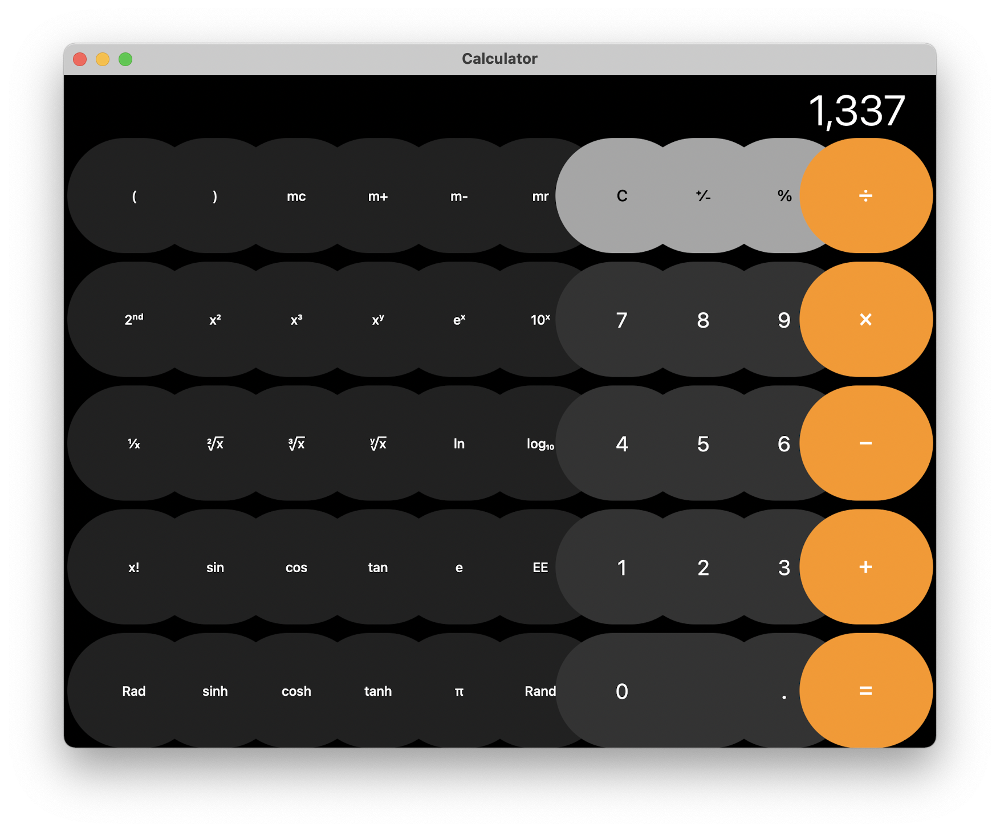

# marzipanify-s

A modified version of marzipanify (by @stroughtonsmith) that allows bringup of the Contacts app from the iOS 14 Simulator as well as some iOS system apps on macOS Big Sur. **This tool is unsupported.**

A previous version of this repo supported macOS Catalina. See the commit history for more details.

This tool has not been tested on macOS Monterey; as such, these instructions are only valid for macOS Big Sur 11.6.x. You may need to modify code (e.g. changing the versions the tool sets in LC_BUILD_VERSION et al.) to make this work on macOS Monterey.

## Howto

Before you begin, copy Contacts.app from the iOS 14 Simulator runtime to a directory where you have write access. How to do this is left as an exercise to the reader.

If you don't already have Xcode or the Command-Line Tools installed, you can install the necessary things with `xcode-select --install`.

There is no need to disable SIP.

From here, the steps are:

1. `git clone <repo-url>`
2. `cd /path/to/repo/`
3. `make`
4. `make remove-x86 APPNAME=Contacts BINNAME=Contacts` (This step uses `lipo` to remove unwanted slices. If on Intel, change `remove-x86` to `remove-arm64`.)
5. `./marzipanify /path/to/Contacts.app`
6. `make unquarantine` (This disables the Gatekeeper warning when you run the app.)
7. Run your app!

## Running iOS system apps on macOS

On Macs with Apple silicon, this tool supports converting iOS system apps from an IPSW file to Mac Catalyst apps. Here's how to do this:

1. Download an iOS 14.7.x or iPadOS 14.7.x IPSW (iPadOS recommended) for a device with the A11 processor or older. There are websites online that allow you to do this.
    * The processor requirement is important - A12 and newer devices use the arm64e architecture instead of arm64, but macOS on Apple Silicon does not (yet) support running arm64e binaries without first disabling SIP and setting an NVRAM boot argument. In addition, enabling arm64e support is only recommended when you are developing drivers with DriverKit. For more details, see Apple's documentation [here.](https://developer.apple.com/documentation/driverkit/debugging_and_testing_system_extensions)
2. Rename the .ipsw file extension to .zip, then double-click the zip file to extract its contents.
3. There will be three DMG files in the extracted zip file's contents. Double-click the largest one to mount it. This is the root filesystem.
    * In the past, root filesystem DMGs in IPSWs were encrypted. This is no longer the case.
4. In the mounted volume, system applications can be found in /Applications as well as /var/staged_system_apps. Copy the apps you want to convert to a directory where you have write access. The Contacts app is a good first app to try.
5. Follow the steps in the "Howto" section to convert these apps to Mac Catalyst apps, but skip the `make remove-x86` step (iOS apps do not contain an x86_64 slice). Please note that some apps will not run due to differences in libraries present in iOS and in macOS. If you want to figure out what is causing an app to crash, it is best to inspect the crash report.
6. That's all!

### Apps known to work without modification using this method

iOS Simulator:

* Contacts (14.5)
  * Only tested on Apple silicon

iOS:

* Calculator (14.7.1)
  * Has oversized buttons, but otherwise works well and responds to resizing the window. With a couple tweaks, Apple could ship this on iPad.
* Contacts (14.7.1)
